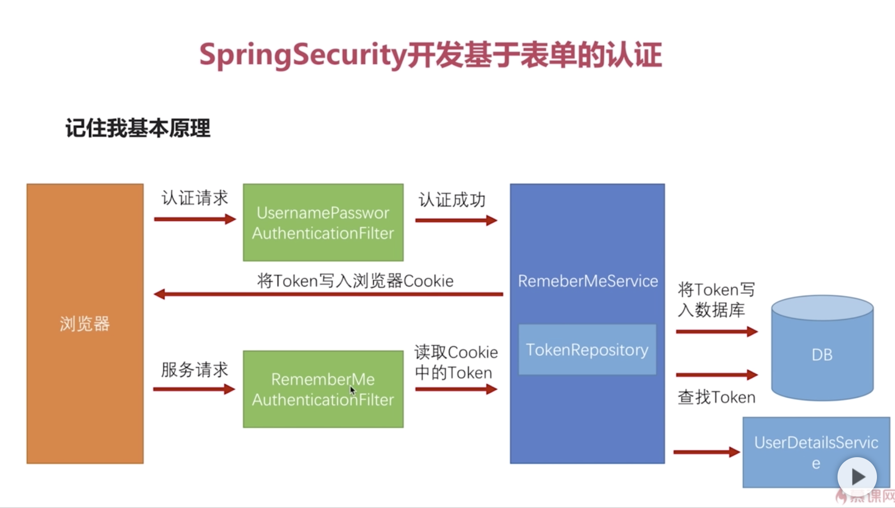
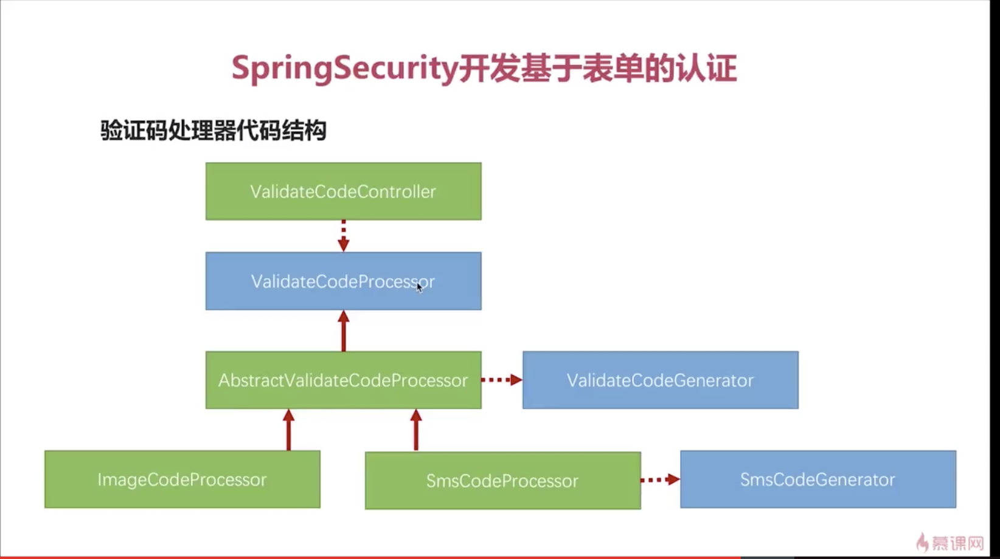
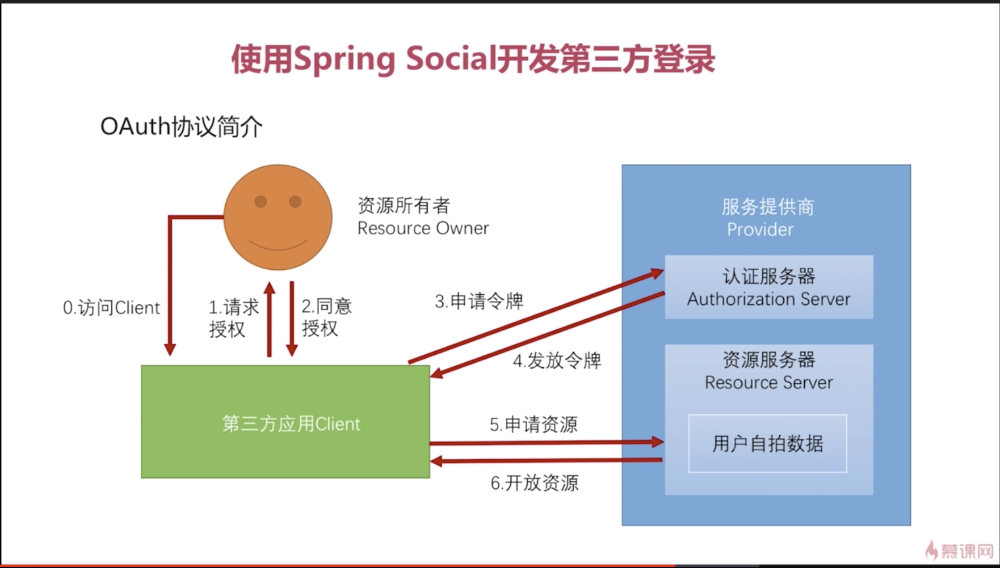
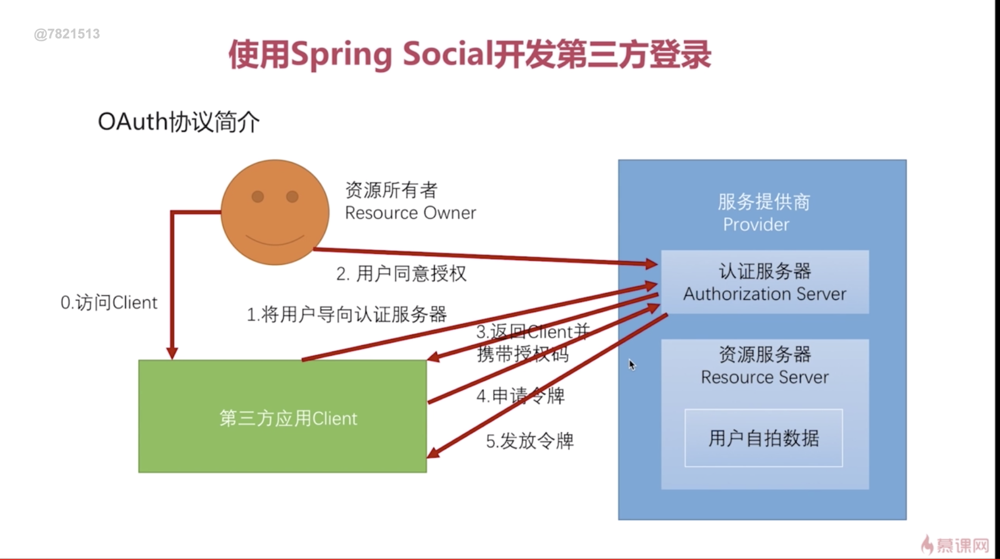
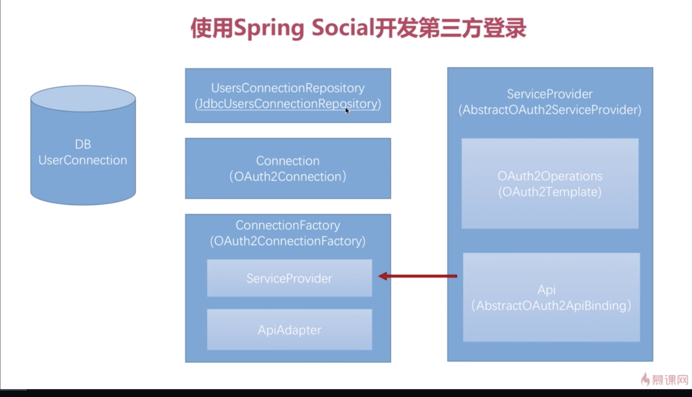

## spring_security
    spring-security-core:核心业务逻辑
    spring-security-browser:浏览器安全特定代码
    spring-security-app:app相关特定代码
    spring-security-demo:样例程序
    
## RESTful API
    查询  /user?name =tom     GET
    详情  /user/1             GET
    创建  /user               POST
    修改  /user/1             PUT
    删除  /user/1             DELETE
    
     1.用URL描述资源；
     2.使用HTTP方法描述行为，使用HTTP状态码来表示不同的结果；
     3.使用json交互数据；
     5.RESTful只是一种风格，并不是强制的标准；
    
## JsonPath gitHub 网址
    
    
## filter interceptor aspect
    filter:性能监控
    interceptor:获取方法所属的的类名，方法名
    aspect:
        性能监控，获取原始的http请求和响应信息，拿不到真正处理方法的信息；
        获取方法所属的类名、方法名，获取原始的http请求和响应信息及真正处理方法的信息，拿不到调用方法
        参数的值；
        获取不到原始的http请求和响应信息，能获取真正处理方法的信息及处理方法的参数的值
        
    三者之间的顺序：
       filter->interceptor->controllerAdvice->aspect->controller
       
       
## spring security 基本原理
    spring security 最核心的东西就是过滤器链，就是一组过滤器；
    最主要的过滤器：
        UsernamePasswordAuthenticationFilter->处理表单登录->验证一个请求是否带登录名和密码
        BasicAuthenticationFilter->处理http basic登录 ->
        
        
        
        UsernamePasswordAuthenticationFilter->BasicAuthenticationFilter->.....->ExceptionTranslationFilter(捕获FilterSecurityInterceptor抛出的异常，根据异常做相应的引导和提示)
        ->FilterSecurityInterceptor(过滤器链最后一环，依据代码的配置去做验证)
        
        一般的应用应该有十几个过滤器；
        UsernamePasswordAuthenticationFilter、BasicAuthenticationFilter等过滤器都可以通过配置来使其是否生效；
        
        
        登录流程：
        带密码登录：
        UsernamePasswordAuthenticationFilter->FilterSecurityInterceptor->通过->controller
        UsernamePasswordAuthenticationFilter->FilterSecurityInterceptor->不通过->ExceptionTranslationFilter->根据异常做相应的引导和提示
        不戴密码登录：
        
        FilterSecurityInterceptor->ExceptionTranslationFilter->根据异常做相应的引导和提示->表单登录->UsernamePasswordAuthenticationFilter->FilterSecurityInterceptor
        
## 自定义用户认证逻辑
    
    处理用户信息获取逻辑  UserDetailsService
        1.用户信息获取逻辑封装在 UserDetailsService 里面， loadUserByUsername;
        2.
    
    处理用户校验逻辑  UserDetails
    
    
    处理密码加密解密   PasswordEncoder
    
    
    
## 处理不同类型的请求
   
   
   
## 个性化用户认证流程

    自定义登录成功处理
    
    自定义登录失败处理
    
## 认证流程源码级详解
    认证处理流程说明
   
    
    认证结果如何在多个请求之间共享
    
    获取认证用户信息
   
## 图形验证码
   

##  记住我基本原理
   
   
## 验证码处理器代码结构
   
   
   
   
## OAuth协议
    OAuth协议要解决的问题
    
    OAuth协议中的各种角色
    
        Provider 服务提供商
        Resource Owner 资源所有者
        第三方应用Client
        认证服务器：Authorization Server
        资源服务器：Resource Server  
    
    OAuth协议运行流程
   
   
   OAuth协议中的授权模式：
   授权码模式（authorization code）(主)：功能最完整，流程最严密的模式，安全性最高；
   
   
   简化模式(implicit)(少)：
   密码模式(resource owner password credentials)（app）：
   客户端模式(client credentials)（少）：
   
## Spring Social
   
   
   
## qq登录
    腾讯开放平台
    https://open.tencent.com/
    